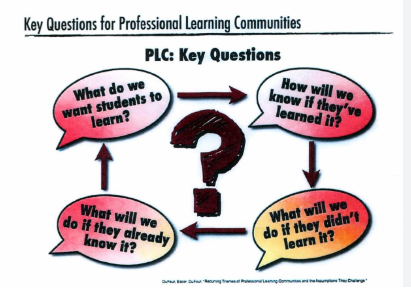

<!-- headingDivider: 1 -->
<!-- backgroundColor: black -->
<!-- class: invert -->

# Agenda

- Intros
- Certification Exams: Lessons Learned from Fall 2024
- Python 2 Curriculum: Lessons Learned from Fall 2024

# Housekeeping

- Complete the attendance form
- Note catcher (volunteer?)

# PLC Resources

[whlapinel.github.io/python-plc](https://whlapinel.github.io/python-plc)

# District Facilitator for Spring 2025

- 5th year teaching
- 5th year in CMS
- Previously taught Science at South Meck
- New to CTE and Python

# Guiding Questions

- What do we want students to know?
- How will we know when they've learned it?
- What will we do if they haven't learned it?
- What will we do if they've already learned it?

