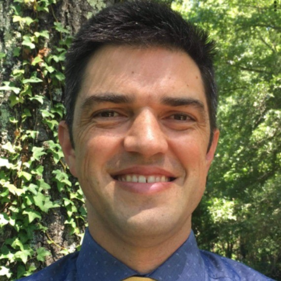

<!-- headingDivider: 1 -->
<!-- backgroundColor: black -->
<!-- class: invert -->

# Attendance

[Use this link](https://343b.edulnk.com/e/xv2a34/3mkWSd?__$u__)

# PLC Resources Site

[Link](https://bit.ly/3WQkQFh)

# District Facilitator for Spring 2025

- 5th year teaching
- 5th year in CMS
- Previously taught Science at South Meck
- New to CTE and Python

# Guiding Questions

- What do we want students to know?
- How will we know when they've learned it?
- What will we do if they haven't learned it?
- What will we do if they've already learned it?

# PLC Website

# Lapinel's Course Curricula

- Python 1 and 2
- Not the "official" curricula; you don't have to use
